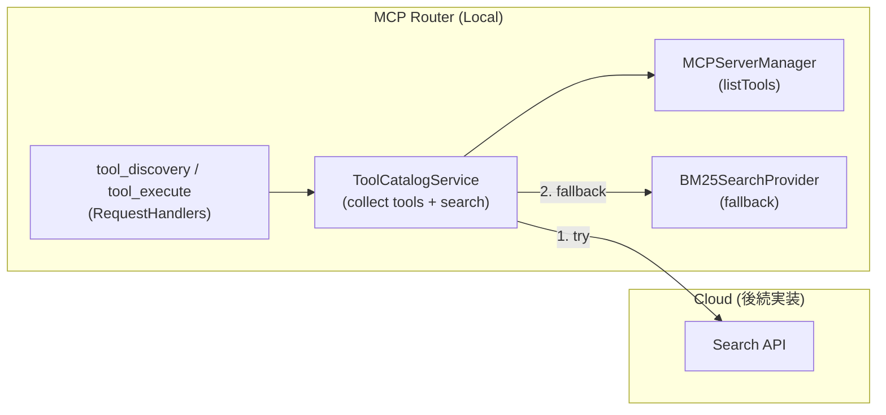

# Tool Catalog & Search 設計

## TL;DR
- 検索/実行は固定の MCP メタツール `tool_discovery` / `tool_execute` で提供し、動的なツール追加は行わない。
- 検索リクエスト時に Available Tool List を収集し、クラウド Search API で検索。失敗時はローカル BM25 にフォールバック。
- token・project・`tool_permissions`・稼働状況によるフィルタはローカルで適用する。検索対象/結果はツールのみ。
- UI 変更は最小限。検索 UI/CLI は増やさず、フロントはメタツール経由で利用する。

## 現状と課題
- `AggregatorServer` + `RequestHandlers` が複数 MCP サーバを集約し、HTTP 入口 `MCPHttpServer` は `_meta.token/_meta.projectId` を付与して転送。
- サーバ設定・稼働状態は `MCPServerManager` + SQLite（`servers.tool_permissions` を含む）で保持。ツール/リソース/プロンプトのメタは永続化せず、毎回 `listTools/listResources/listPrompts` で取得。
- ワークスペース切替時に DB/サービスはリセット。`PlatformAPI` にカタログ検索系がなく、UI/CLI から検索不可。LLM も固定メタツールがなく、自然文検索/指定実行ができない。

## ゴールと非ゴール

### Phase 1: ローカル検索（現在）
- ゴール
  - `tool_discovery` / `tool_execute` を通じて LLM/既存 MCP クライアントがプロジェクト/トークン境界を保ったまま検索・実行できる。
  - BM25 アルゴリズムによるローカル検索を提供する。
  - 検索リクエスト時に Available Tool List を動的に収集し、事前のインデックス化は不要とする。
- 非ゴール
  - CLI 向け新規コマンドや検索専用 UI の追加は行わない。
  - ツール実行回数の集計やレコメンドは後続。
  - `listTools` で動的に全ツールを追加/更新することはしない（固定2ツールのみ）。
  - プロンプト/リソースの検索は対象外。
  - ローカルにカタログ DB を永続化しない。

### Phase 2: クラウド検索（後続）
- ゴール
  - クラウド Search API による高度な検索（LLMベース選択など）を提供する。
  - フォールバック戦略: クラウド Search API → 失敗 → ローカル BM25 にフォールバック。
- 非ゴール
  - クラウドへのカタログ同期（Available Tool List はリクエスト時に送信するため不要）。

## ユースケース/要求
- 機能: 自然文クエリ＋`maxResults` でツール検索し、スコア付き結果を返す。
- 実行: `tool_execute` で `toolKey`/`arguments` を指定して実行し、`tool_permissions`/稼働状況/トークン境界を検証する。
- 監査: 検索リクエストを `mcp-logger` に記録する。
- セキュリティ: token 未指定時の扱いを明確化（デフォルト拒否）。`tool_permissions=false` は検索対象外。`projectId` 不一致は除外。

## アーキテクチャ概要
- ローカル: 検索リクエスト時に稼働中サーバから Available Tool List を収集し、検索プロバイダーに委譲。
- 検索プロバイダー: クラウド Search API（優先）→ ローカル BM25（フォールバック）。
- 入口: 検索/実行は MCP メタツールに統一。

## プロジェクト設定

ツールカタログはプロジェクト毎に設定を保持できる。設定は `projects` テーブルの `optimization` カラムに保存される。

### 設定項目
```typescript
// packages/shared/src/types/project-types.ts
type ToolCatalogSearchStrategy = 'bm25' | 'cloud';
type ProjectOptimization = ToolCatalogSearchStrategy | null;

// projects.optimization カラム: ProjectOptimization
// - null: ツールカタログ無効
// - 'bm25': ローカル BM25 検索
// - 'cloud': クラウド検索（Phase 2 で実装予定）
```

### 動作
- `optimization = null` の場合、`tool_discovery` は空の結果を返す。
- `optimization = 'cloud'` を選択していても、クラウド検索が利用不可の場合は BM25 にフォールバック。

### UI
- プロジェクト設定モーダル（歯車アイコン）から「Context Optimization」を編集可能。
- トグル OFF → `optimization = null`（無効）
- トグル ON + 戦略選択 → `optimization = 'bm25'` または `'cloud'`

## コンポーネントと責務

### ローカル (Router/Electron)
- ToolCatalogService（統合サービス）: 以下の機能を統合して提供。
  - **ツールリスト収集**: 検索リクエスト時に `MCPServerManager` が保持する稼働サーバから `listTools` を実行し、`tool_permissions`/`projectId`/`serverStatusMap` でフィルタした Available Tool List を構築。
  - **検索プロバイダー管理**: クラウド Search API → ローカル BM25 のフォールバック戦略を実装。
- SearchProvider インターフェース: 検索アルゴリズムの抽象化。
  - `BM25SearchProvider`: ローカル BM25 検索（フォールバック用）。
  - `CloudSearchProvider`（後続）: クラウド Search API 呼び出し。
- RequestHandlers（メタツール）: `AggregatorServer`/`RequestHandlers` に `tool_discovery` / `tool_execute` を追加。`CallTool` で捕捉し、`ToolCatalogService` に委譲。`ListTools` は固定2ツールのみを返す。
- Logging: `tool_discovery`/`tool_execute` 呼び出し結果を `mcp-logger` に送出。

### クラウド（後続）
- Search API: `/catalog/search` で Available Tool List と Query を受け取り、適切なツールを選択して返却。
- Auth: Router 発行トークンを Bearer で検証。`projectId` 境界でのアクセス制御を行う。

## API とスキーマ

### クラウド REST（案）
- `POST /catalog/search`
  ```ts
  type ToolInfo = {
    toolKey: string; // `${serverId}:${toolName}`
    toolName: string;
    serverName: string;
    description?: string;
  };
  type SearchRequest = {
    query: string[]; // Search Queries
    context?: string; // Background information or task description
    tools: ToolInfo[]; // Available Tool List
    maxResults?: number;
  };
  type SearchResult = {
    toolKey: string;
    toolName: string;
    serverName: string;
    description?: string;
    relevance: number;      // 0-1 正規化スコア
    explanation?: string;   // 選択理由
  };
  type SearchResponse = { results: SearchResult[] };
  ```

### MCP メタツール `tool_discovery`
- Input（CallTool `arguments`）:
  ```ts
  {
    query: string[]; // Search Queries
    context?: string; // Background information or task description (for Cloud search)
    maxResults?: number;
  }
  ```
- Output:
  ```ts
  {
    results: Array<{
      toolKey: string;
      toolName: string;
      serverName: string;
      description?: string;
      relevance: number;      // 0-1 正規化スコア
      explanation?: string;   // 任意の説明（選択理由など）
    }>;
  }
  ```
- 実装:
  1. `CallTool` で捕捉
  2. ローカルで Available Tool List を収集（`TokenValidator`/`toolPermissions`/`serverStatusMap`/`projectId` でフィルタ）
  3. クラウド Search API で検索（失敗時はローカル BM25 にフォールバック）
  4. 選択結果を返却

### MCP メタツール `tool_execute`
- 設計背景: LLM や MCP クライアントによっては会話開始時のツールリストに固定されるため、動的にツールを実行できるよう固定メタツール経由でラップしている。
- Input（CallTool `arguments`）:
  ```ts
  {
    toolKey: string; // `${serverId}:${toolName}` など
    arguments?: unknown;
  }
  ```
- Output:
  ```ts
  {
    result: unknown;
  }
  ```
- 実装: `CallTool` で捕捉→`TokenValidator`/`toolPermissions`/`serverStatusMap`/`projectId` 検証→対象サーバへ `tools/call` を委譲。

## 主要フロー

### Search
1. クライアントが MCP で `tool_discovery` を CallTool（`_meta.token/_meta.projectId` 付き）。
2. `ToolCatalogService` が稼働サーバから Available Tool List を収集（`TokenValidator`、`toolPermissions`、`serverStatusMap`、`projectId` でフィルタ済み）。
3. 検索プロバイダーに委譲:
   - **クラウド検索（優先）**: `/catalog/search` に Query と Available Tool List を送信。
   - **失敗時フォールバック**: ローカル BM25 検索で候補をスコアリング。
4. 選択結果を MCP レスポンスとして返却。

### Execute
1. クライアント/LLM が MCP で `tool_execute` を CallTool（`_meta.token/_meta.projectId` 付き）。
2. `TokenValidator`/`toolPermissions`/`serverStatusMap`/`projectId` を検証。
3. 対象サーバへ `tools/call` を委譲し、結果を返却。

## エラーハンドリングとセキュリティ
- Token: `_meta.token` がない場合は検索/実行を拒否（要件によりオプションで許可）。401/403 は UI に表示。
- Project: `_meta.projectId` が `UNASSIGNED_PROJECT_ID` または空の場合は null として扱い、フィルタ適用。
- フォールバック: クラウド Search API は短め（例 5s）。エラー時はローカル BM25 にフォールバック。
- ロギング: `requestId`, `serverId` を含めてローカルログに記録。

## 段階的実装プラン

### Phase 1: ローカル検索 ✅
1. 型整備: `packages/shared` に `SearchRequest/SearchResponse` 型を追加。
2. SearchProvider インターフェース: 検索アルゴリズムの抽象化。
3. BM25SearchProvider: ローカル BM25 検索の実装。
4. ToolCatalogService: 検索リクエスト時に Available Tool List を収集し、SearchProvider に委譲。
5. MCP メタツール: `RequestHandlers` に `tool_discovery` / `tool_execute` を追加。

### Phase 2: クラウド検索（後続）
1. CloudSearchProvider: クラウド Search API クライアントを実装。
2. フォールバック戦略: クラウド → BM25 のフォールバックロジックを ToolCatalogService に実装。
3. 計測/テスト: クラウド検索の精度評価、フォールバック挙動のテスト。

## 計測とテスト観点
- スモーク: `tool_discovery` で検索できる、`tool_execute` で実行できる。
- 負荷: 10+ サーバ時の検索応答時間を計測。
- 信頼性: クラウド検索失敗時のフォールバック挙動を確認。
- 回帰: `listResources/listPrompts` は従来通り、`listTools` は固定2ツールのみで動くことを確認。

## リスク・未決事項
- Search API スキーマの安定化とバージョン付け。後方互換をどう保つか。
- 非稼働サーバの結果をどこまで表示するか（現状は除外想定）。
- token 未指定時のポリシーを最終決定する必要がある。

## アーキテクチャ図（Mermaid）

